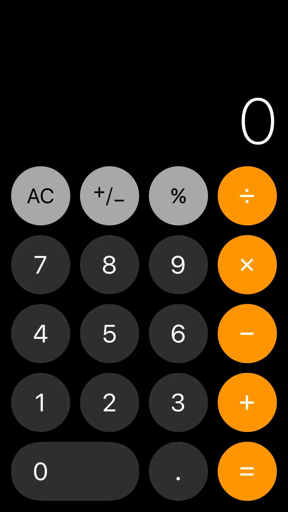
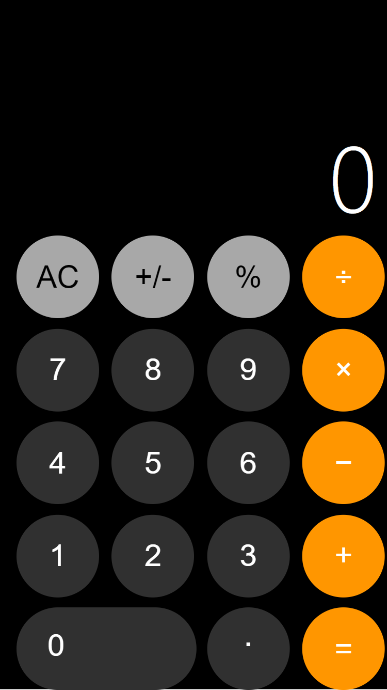

# Calculator_iPhone

## Repository Overview

**Repository Name:** Calculator_iPhone  
**Owner:** [mihaiapostol14](https://github.com/mihaiapostol14)  
**Visibility:** Public  
**Default Branch:** main  
**Languages:**
- HTML: 62.7%
- CSS: 37%
- JavaScript: 0.3%

## Repository Details

- **Created On:** March 1, 2024
- **Last Pushed:** March 6, 2025
- **Last Updated:** 18 minutes ago
- **Size:** 435 KB
- **License:** Not specified
- **Homepage:** Not specified
- **Topics:** None specified

## Repository Features

- **Forking:** Allowed
- **Issues:** Enabled
- **Projects:** Enabled
- **Wiki:** Enabled
- **Downloads:** Enabled
- **Discussions:** Disabled
- **GitHub Pages:** Disabled

## Repository Statistics

- **Forks:** 0
- **Open Issues:** 0
- **Stargazers:** 0
- **Watchers:** 0
- **Network Count:** 0
- **Subscribers:** 1

## Repository Links

- **Repository URL:** [Calculator_iPhone](https://github.com/mihaiapostol14/Calculator_iPhone)
- **Owner Profile:** [mihaiapostol14](https://github.com/mihaiapostol14)

## Cloning the Repository

To clone the repository, use the following command:

```bash
git clone https://github.com/mihaiapostol14/Calculator_iPhone.git
```

## Images

### Calculator Maket


### My Result


## Summary

This repository contains the source code for a Calculator application designed for iPhone. The project primarily uses HTML and CSS, with a small portion of JavaScript. The repository is public and open for contributions, issues, and discussions. It has not been forked or starred yet but is actively maintained.
